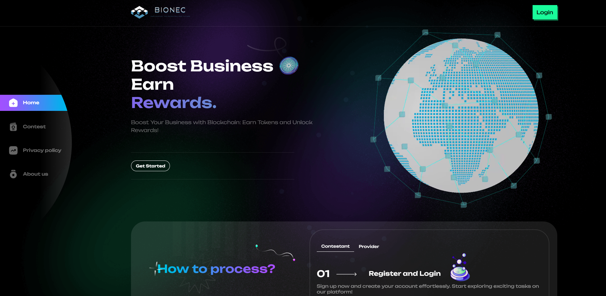

# syncodeid
## Hackaton 11 ICP

  

## [Install the IC SDK]
   - [https://internetcomputer.org/docs/building-apps/getting-started/quickstart](https://internetcomputer.org/docs/building-apps/getting-started/quickstart)

## 🚀 Initial Project
    - Change directory cd {MyProject}
    - dfx start or dfx start --clean
    - Install dependencies npm install
    - dfx deploy
    - dfx generate
    - npm run start

## 📝 Documentations
- [INTERNET COMPUTER](https://internetcomputer.org/docs/building-apps/getting-started/quickstart)

## 🎉 Credits

This project relies heavily on these free and open-source libraries. All credits go to the individuals and communities who contributed to the development and maintenance of these libraries.
- [tailwindcss](https://tailwindcss.com/)
- [motoko](https://tailwindcss.com/)

